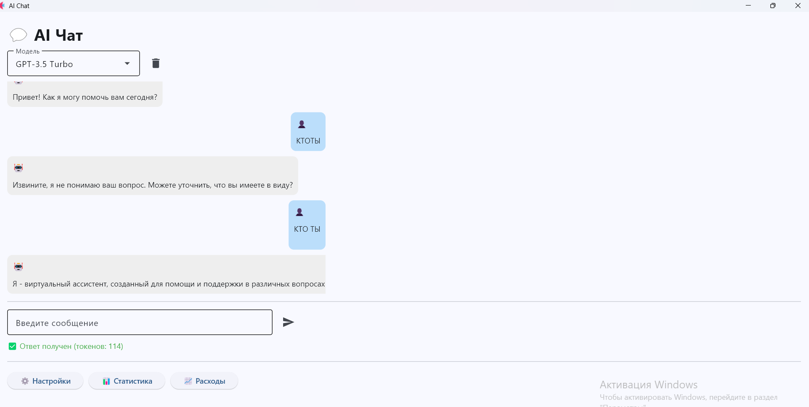
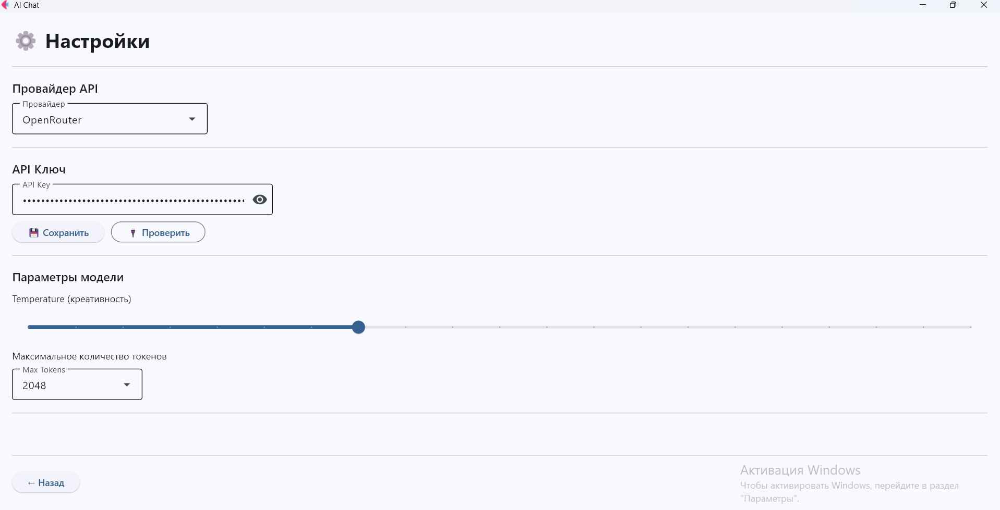
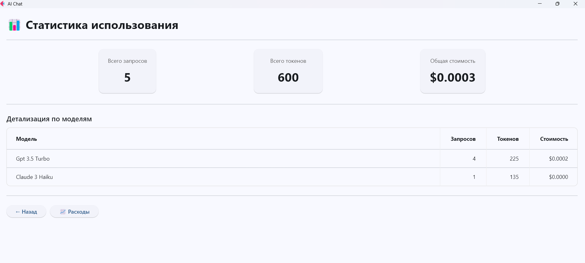
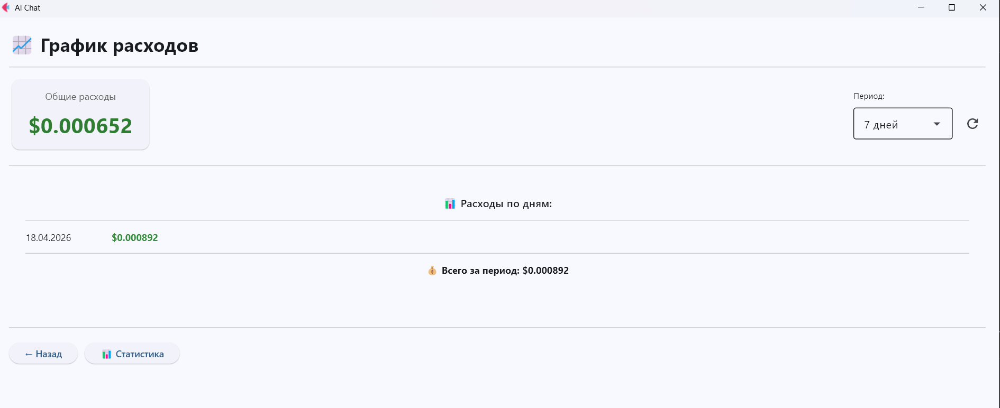

# AI Chat — многостраничное приложение на Flet

Многостраничное приложение для общения с AI-моделями через OpenRouter API. Включает чат, настройки провайдера, статистику использования токенов и график расходов.

Проект выполнен в рамках итоговой аттестации. Демонстрирует навыки разработки многостраничных приложений на Python с использованием Flet.

## Скриншоты

| Главная страница | Настройки | Статистика | Расходы |
|------------------|-----------|------------|---------|
|  |  |  |  |

## Функционал

### Главная страница (Чат)
- Отправка сообщений к AI-моделям через OpenRouter API
- Поддержка моделей: GPT-3.5 Turbo, GPT-4, Claude 3 Haiku, Gemini Pro
- История диалога с разделением сообщений пользователя и AI
- Отображение количества использованных токенов
- Очистка истории чата

### Настройки провайдера
- Выбор провайдера: OpenRouter или VseGPT
- Сохранение API-ключа в локальном JSON-файле
- Настройка параметров генерации: Temperature и Max Tokens
- Автоматическая загрузка сохраненных настроек

### Статистика использования
- Общее количество запросов и токенов
- Детализация по моделям: запросы, токены, стоимость
- Таблица с сортировкой по столбцам
- Карточки с общей сводкой

### График расходов
- Отображение расходов по дням
- Выбор периода: 7, 14 или 30 дней
- Подсчет общей суммы за период
- Автоматический расчет стоимости на основе токенов

## Технологии

- Python 3.12
- Flet (Flutter for Python)
- OpenRouter API
- Requests
- Matplotlib
- JSON (локальное хранение данных)

## Структура проекта
chatai/
├── main.py # Точка входа и навигация
├── settings.json # Настройки провайдера
├── stats.json # Статистика использования
├── requirements.txt # Зависимости
├── README.md # Документация
│
├── pages/
│ ├── home.py # Чат
│ ├── settings.py # Настройки
│ ├── stats.py # Статистика
│ └── expenses.py # Расходы
│
├── services/
│ ├── api.py # OpenRouter API
│ └── storage.py # Локальное хранилище
│
├── models/
│ └── usage.py # Модель данных
│
└── screenshots/
├── home.png
├── settings.png
├── stats.png
└── expenses.png

text

## Установка и запуск

### 1. Клонирование репозитория
```bash
git clone https://github.com/Khoroshil/aichat-flutter.git
cd aichat-flutter
2. Установка зависимостей
bash
pip install -r requirements.txt
3. Получение API-ключа
Зарегистрироваться на OpenRouter

Создать API-ключ в личном кабинете

4. Запуск
bash
python main.py
5. Настройка
Перейти на вкладку "Настройки"

Вставить API-ключ

Выбрать провайдера (OpenRouter)

Настроить параметры генерации

Нажать "Сохранить"

Формат хранения данных
settings.json
json
{
  "provider": "openrouter",
  "api_key": "sk-or-v1-...",
  "temperature": 0.7,
  "max_tokens": "2048"
}
stats.json
json
{
  "total_tokens": 1250,
  "model_stats": {
    "openai/gpt-3.5-turbo": {
      "tokens": 850,
      "requests": 5,
      "cost": 0.00085
    }
  },
  "daily_expenses": {
    "2026-04-18": 0.00085
  }
}
Особенности реализации
Многостраничная навигация через функцию navigate() и контейнер с динамическим содержимым

Сохранение настроек и статистики в JSON-файлы

Подсчет стоимости с учетом разных тарифов для разных моделей

Визуализация расходов через Matplotlib

Лицензия
MIT

Автор
Хорошилов Владимир
GitHub: @Khoroshil


